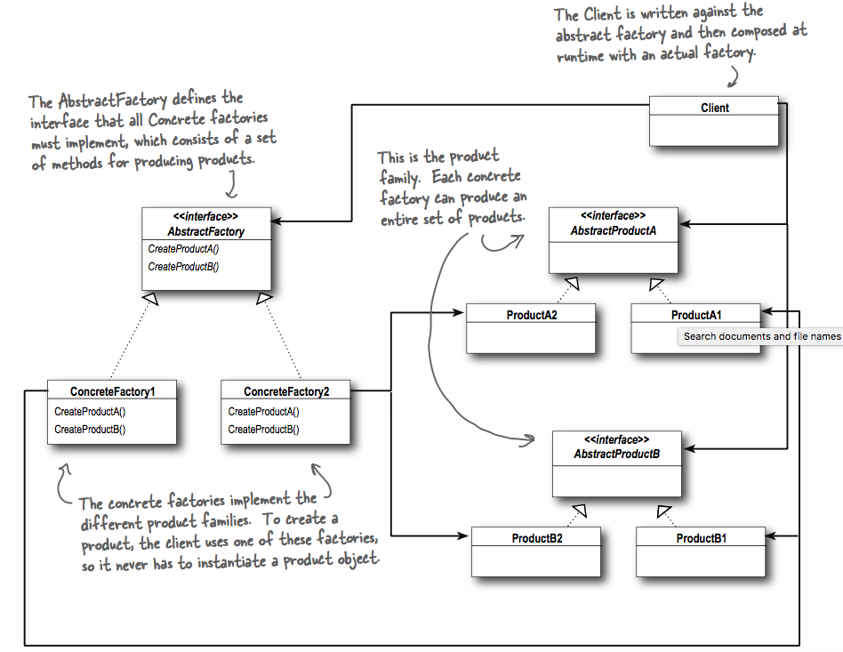
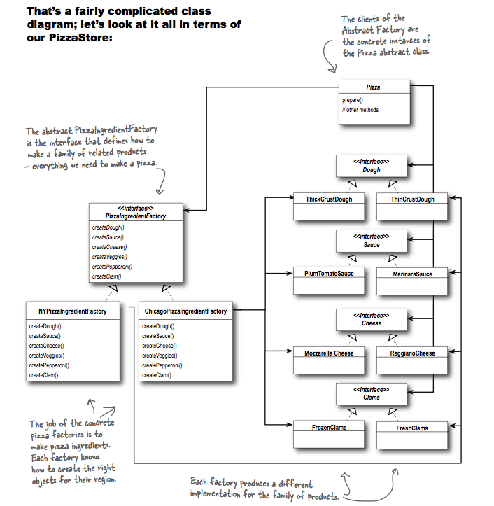

## What it's used for?
- it provides an interface for creating families of related or dependent objects without specifying their concrete classes.
- use it when you have families of products you need to create and you want to make sure your clients create products that belong together (pizza ingredients).

## How to use?
- UML class:

- Example:

## Compare to Factory Method
- Factory Method is a natural way to implement your product methods in your abstract factories: each method is declared abstract (`createDough`, `createSauce`, etc.) and the subclasses override it to create some object - that's Factory Method.
- Factory Method usually implement code in the abstract creator that makes use of the concrete types of the subclasses crete (code in `orderPizza` use pizza from the abstract `createPizza` method).
