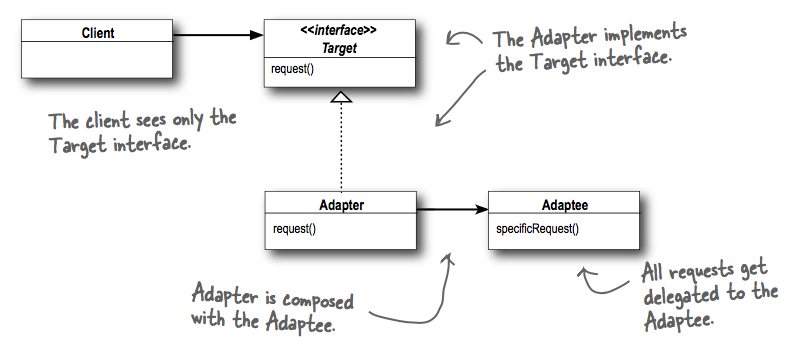
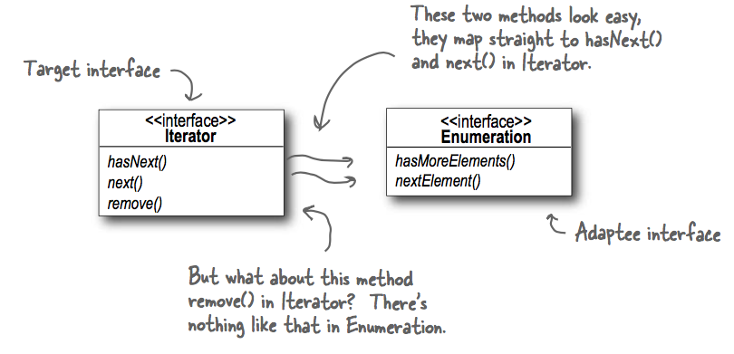

## What it's used for?
- convert the interface of a class into another interface the clients expect. Adapter lets classes work together that couldn't otherwise because of incompatible interfaces.
- it decouples the client from the implemented interface; if the interface is expected to be changed over time, the adapter encapsulates that change so that the client doesn't have to be modified each time it needs to operate against a different interface.

## How to use?
- UML:

- Example:
  - Client works with Duck interface (what client invokes methods on) with fly and quack methods.
  - Our Adaptee is the Turkey interface with fly and gobble methods.
  - To make client work with Turkey interface, we can introduce a TurkeyAdapter class that implements Duck interface and composes a Turkey object, the TurkeyAdapter will pass the client requests for fly and quack to the Turkey object (or - delegate the calls to the Turkey object).
  
- Real world example: new Java interface Iterator and old one Enumeration:
  
  
  - Enumartion is a read-only interface thus we can't implement a fully functioning remove method on the Adapter. The best we can do is throwing a runtime exception.
  - As long as the client is careful and the adapter is well documented this is a perfectly reasonable solution.
  
## Which principles it derives?
- Composition over Inheritance: Adaptee is wrapped in Adapter.
- Program to interface, not to implementation: Adapter can work with any subclasses of Adaptee, and the pattern binds the client to the Target (Duck) interface as well.

## Compare to Decorator Pattern
- Decorator is about adding new behaviors, responsibilities (doesn't alter the interface). Adapter is about converting interfaces (it changes the interface of what it wraps - change Turkey interface to Duck).  
