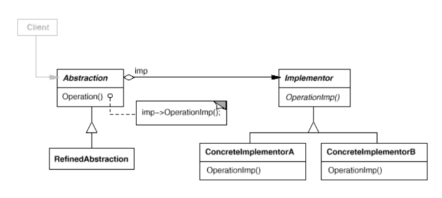
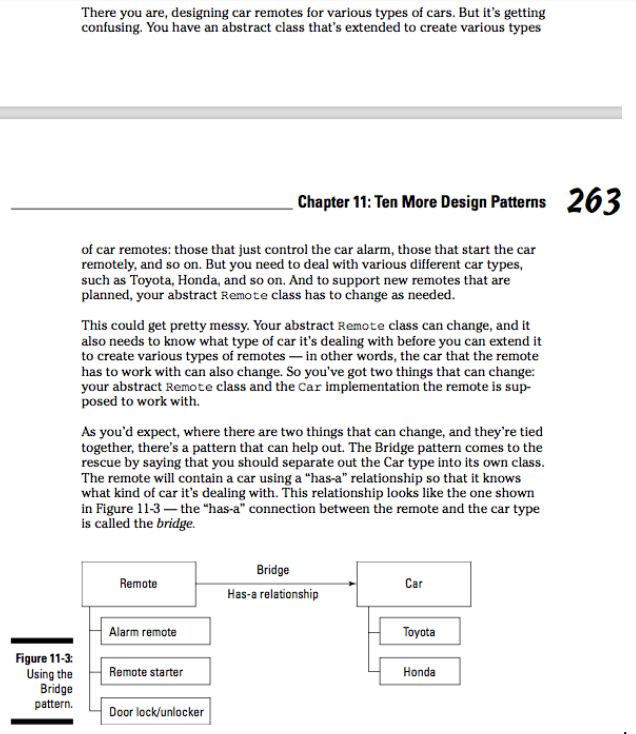

## What it's used for?
- Decouple an abstraction from its implementation so that the two can vary independently.
- Mẫu này được thiết kế với ý tưởng tách rời những xử lý của một lớp ra lớp khác, từ đó có thể dễ dàng biến đổi hoặc thay thế mà không làm ảnh hưởng đến những nơi có sử dụng lớp ban đầu.

## How to use?
- UML:

- Example:

