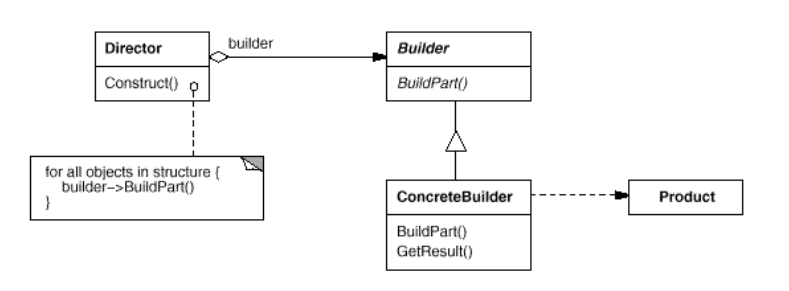
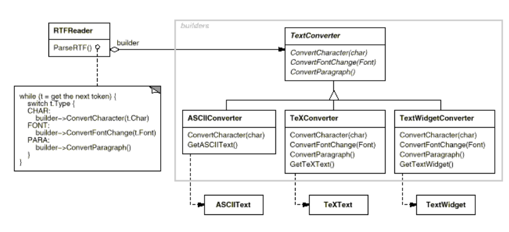
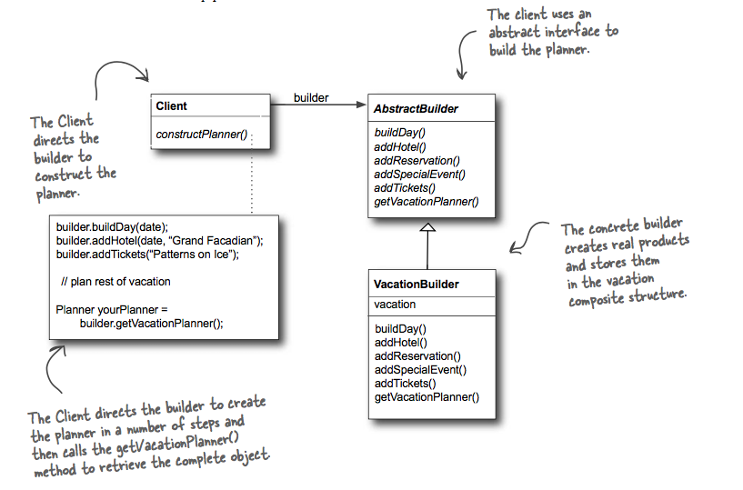

## What it's used for?
- Separate the construction of a complex object from its representation so that the same construction process can create different representations.
- Use the Builder Pattern to encapsulate the construction of a product and allow it to be constructed in steps.
- Trong mẫu này, khách hàng sẽ thiết lập trình tự và số lượng các bước trong thuật toán, và hoán đổi giữa các builder để tạo ra các đối tượng khác nhau thể hiện thuật toán đó.
- Sử dụng mẫu thiết kế này khi khách hàng muốn kiểm soát quá trình tạo dựng, nhưng bạn vẫn muốn tạo ra nhiều đối tượng khác nhau

## How to use?
- UML:

- Examples:

