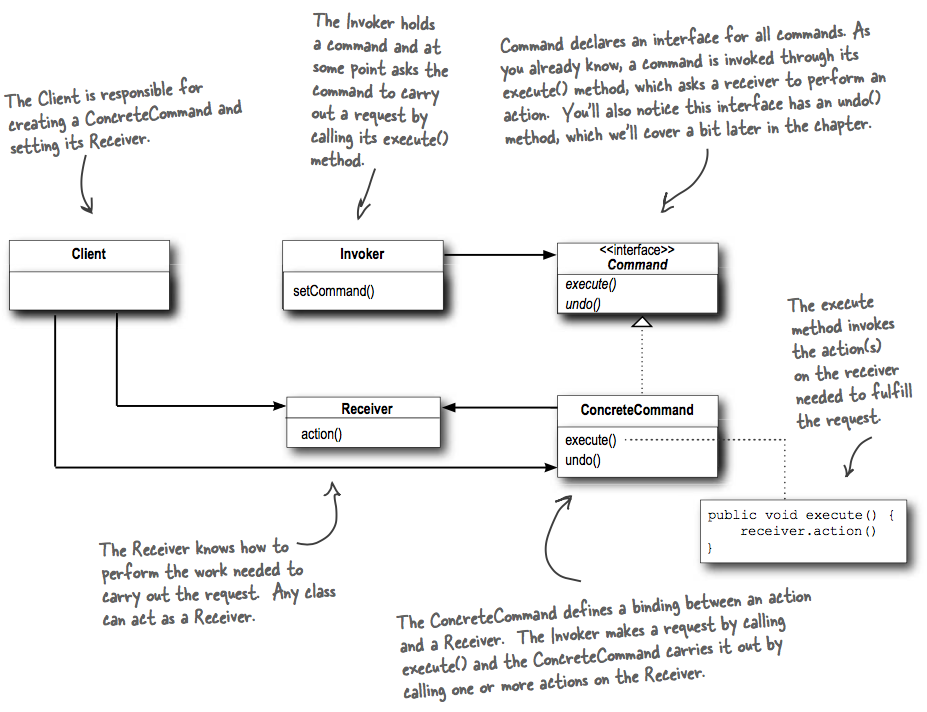
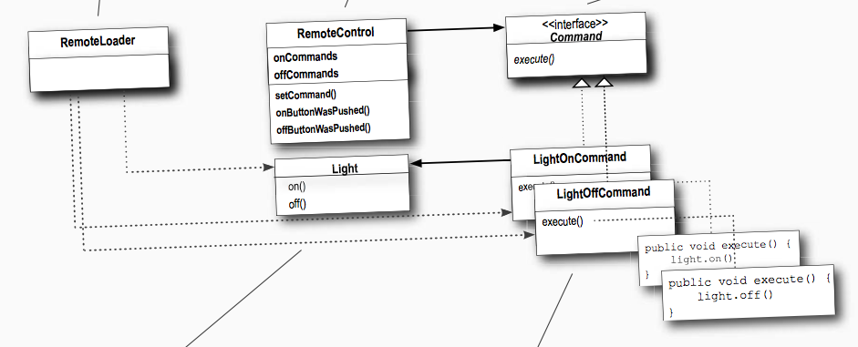

## What it's used for?
- this encapsulates a requests as an object (like packaging `Light` object and its actions like `on` into an object `LightOnCommand` ), thereby letting you parameterize other objects (like setting the `Invoker` - 1 slot of the remote - with different types of `Command`) with different requests, queue or log requests, and support undoable operations.
- Command gives us a way to package a piece of computation (a receiver and a set of actions) and pass it around as a first-class object.
- Some applications:
  - Commands queue
  - The Command can support `store` and `load` method (use object serialization): store object history on disk, reload when a crash occurs to invoke their `execute`.

## How to use
- UML class:

- Example:

- To support undoing action, we can add `undo` method into the `Command` interface to reverse the `execute`.

- You can write a `MacroCommand` implements `Command` to carry out many actions at once.
