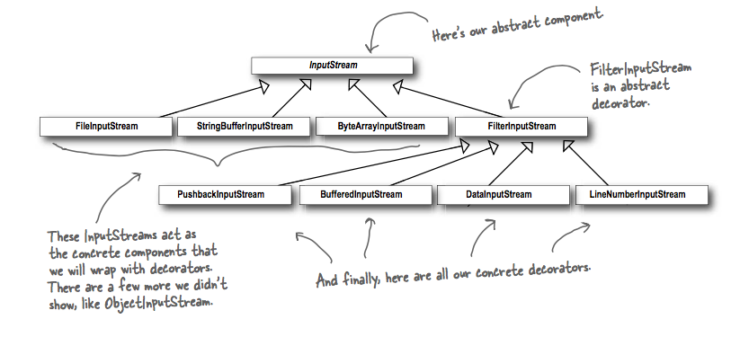

## What it's used for?
- attach **additional responsibilites to an object dynamically**. Decorators provide a flexible alternative to subclassing for extending functionality.
- Giúp viết tiếp mã nguồn, tránh việc sửa đổi lên mã nguồn gốc, trong khi vẫn đáp ứng được nhu cầu thay đổi.
- Gắn kết thêm một số tính năng cho đối tượng một cách linh động. Mẫu này cung cấp một phương pháp linh hoạt hơn là sử dụng lớp con để mở rộng chức năng cho đối tượng
- Dùng để mở rộng hoặc thay đổi chức năng của các đối tượng lúc run-time bằng việc bọc chúng trong một đối tượng của một lớp decorator. Điều này cung cấp một giải pháp linh hoạt thay thế cho việc sử dụng kế thừa để sửa đổi hành vi.

## How to use?
- UML class:

- Example:

## Which principles it derives?
- Open-Closed: the goal is to allow classes to be easily to extend to incorporate new behaviour without modifying existing code.

## Downsides
- If you have code that relies on the concrete component's type, decorators will break that code, you may want to rethink your application design and your use of decorators.
- Decorators add a lot of small classes to a design => lead to not straightforward to understand.
- Introducing decorators can increase the complexity of the code needed to instantiate the component (init component + wrap with many decorators), Factory and Builder could address this.
