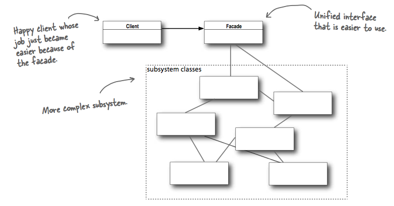
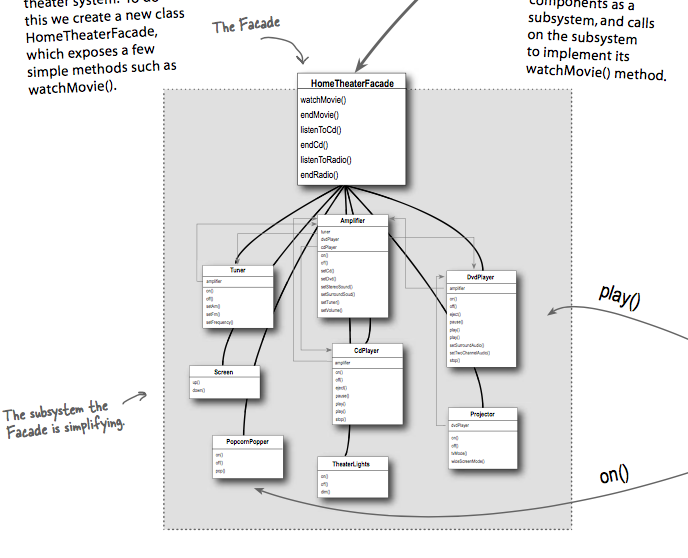

## What it's used for?
- provides an unified interface to a set of interfaces in a subsystem. Facade defines a higher level interface that makes the subsystem easier to use.
- makes an interface simpler.

## How to use?
- UML:

- Example:
  
  
  Notice that Facade doesn't encapsulate the subsystem, it means you could still directly access to the subsystems.

## Which principle it derives?
- Least Knowledge.

## Compare to Adapter:
- Different in their intent: Adapter alter an interface so that it matches one a client is expecting. Facade provide a simplified interface to a subsystem.

## Other notes
- Facade does not only simplify an interface, it decouples a client from a subsystem of components (if those components change, client code doen't need to change).
- A Facade is free to add its own "smarts" in addition to making use of the subsystem.
