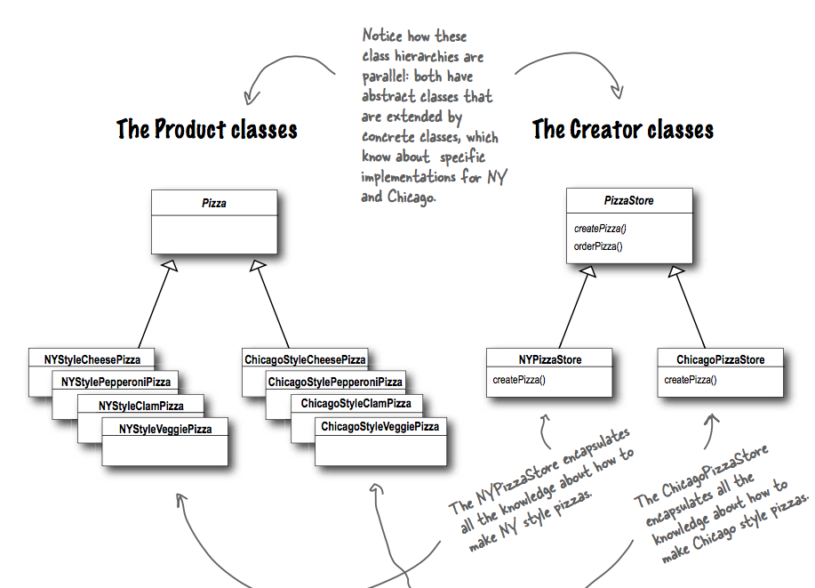

## What it's used for?
- Define an interface (interface or abstract class) for creating an object, but let subclasses decide which class to instantiate. Factory Method lets a class defer instantiation to subclasses.
- use it to decouple your client code (the code in `orderPizza`) from the concrete classes you need to instantiate (the if else part to creata Pizza).

## How to use?
- UML class:

- Example:

The method `orderPizza` uses `createPizza`, the PizzaStore abstract class defers the instantiation of pizza in the method `createPizza` for its subclasses (like NYPizzaStore).

The defered method is called **factory method** (`createPizza` in this case).

## Compare with Simple Factory
- Factory Method provides a general framework for creating pizzas that relies on a factory method to actually create concrete classes that go into making Pizza.
- Simple Factory gives you a way to encapsulate object creation (by composition), but doesn't give you the flexibility of the Factory Method because there is no way to vary the products you're creating.

## Which principles it derives?
- Same as Simple Factory.
