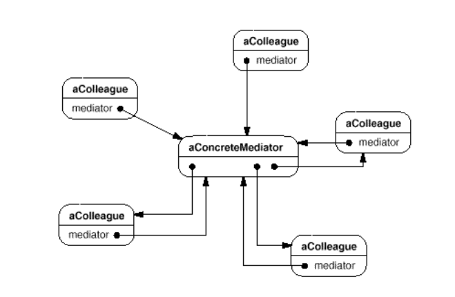
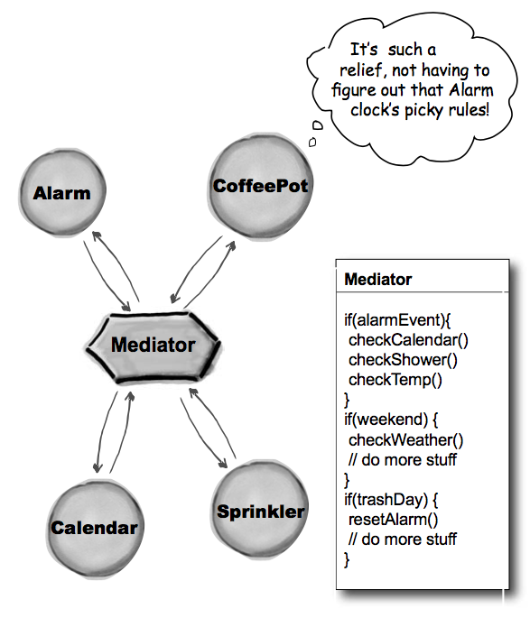

## What it's used?
- Define an object that encapsulates how a set of objects interact. Mediator promotes loose couplingby keeping objects from referring to each other explicitly, and it lets you vary their interaction independently.

## How to use?
- UML:

- Example:

## Drawbacks
- With bad design, mediator object can become complicated.
