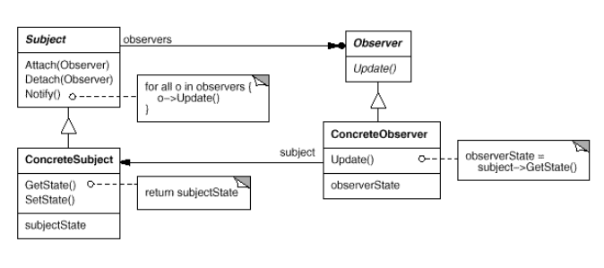
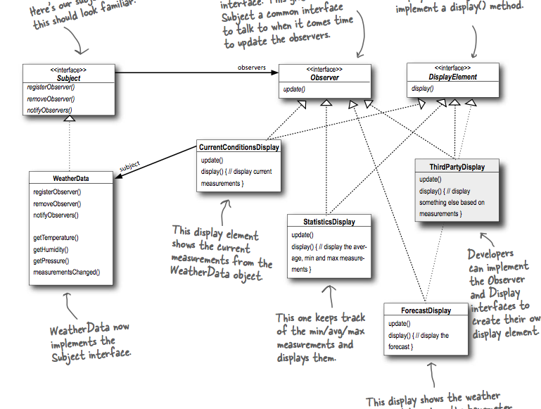

## What it's used for?
- defines a _one-to-many_ (one subject, many observers) dependency between objects so that when one object changes state, all of its dependents are notified and updated automatically.

## How to use?

- UML class:

- Example:

## Other notes

- Publishers + Subscribers = Observer Pattern.

  We call the publisher as the **subject**, subscribers as the **observer**.
  
- The Observer pattern provides loosley coupled designs between objects that interact: the only thing the subject knows about an observer is that it implements a certain feature (the Observer Interface.

- You may want your `update` method signature to be `update(SubjectSubClass subject)` rather than `update(<concrete state of the subject that the observer want to get)`, and then provide some getters on the subject.
  
  This way, each observer can choose from the subject only the state/data that they need.
  
  This is called **pulling the state**.
  
- Never depend on the order of registering/notification observers.
