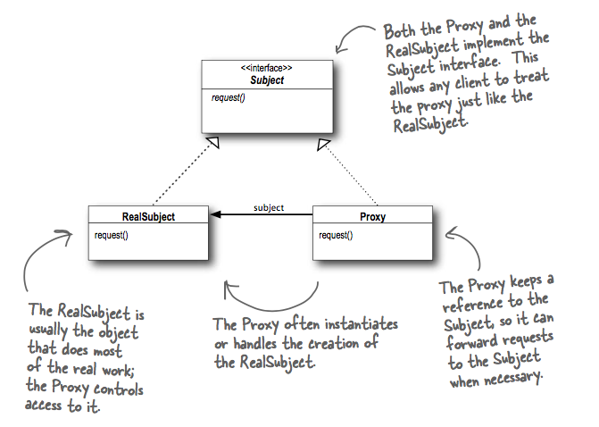
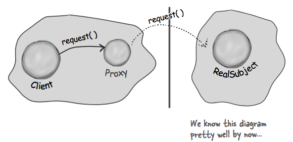
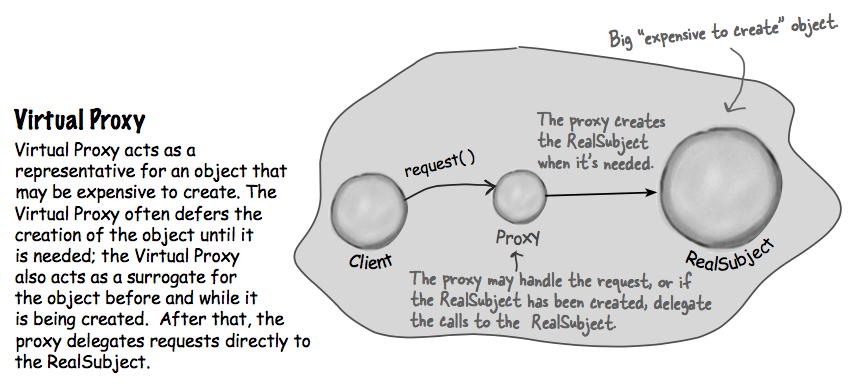
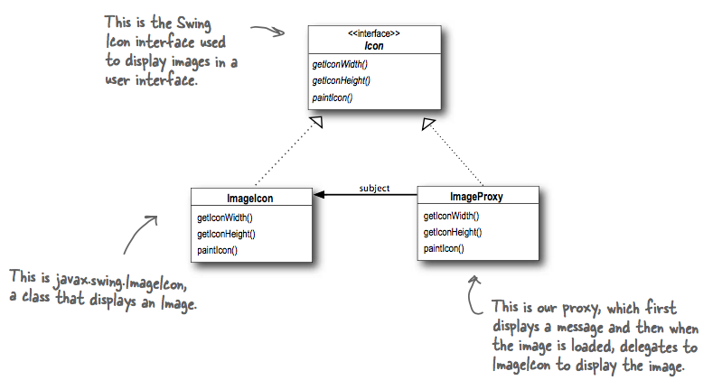

## What it's used for?
- provides a surrogate or placeholder for another object to control access to it.

## How to use?
- UML:
  
  
  In some cases, the Proxy may be responsible for creating and destroying the RealSubject.
  
  The Proxy also controls access to the RealSubject; this control may be needed if:
    - the Subject is running on a remote machine.
    - the Subject is expensive to create in some way.
    - access the the Subject is protected in some way.

- Some ways of using proxy:
  - Remote Proxy: the proxy acts as a local representative for an object that lives remotely.
    
  
  - Virtual Proxy:
    
  
    Example: Displaying a placeholder before the Icon is loaded
    

  - Protection Proxy: a proxy that controls access to an object based on access rights.
    
## Other notes
- How to make clients use the Proxy rather than the Real Subject?
  One common technique is to provide a factory that instantiates and returns the subject. We can wrap the subject with a proxy before returning it. The client never knows or cares that it's using a proxy instead of the real thing.
