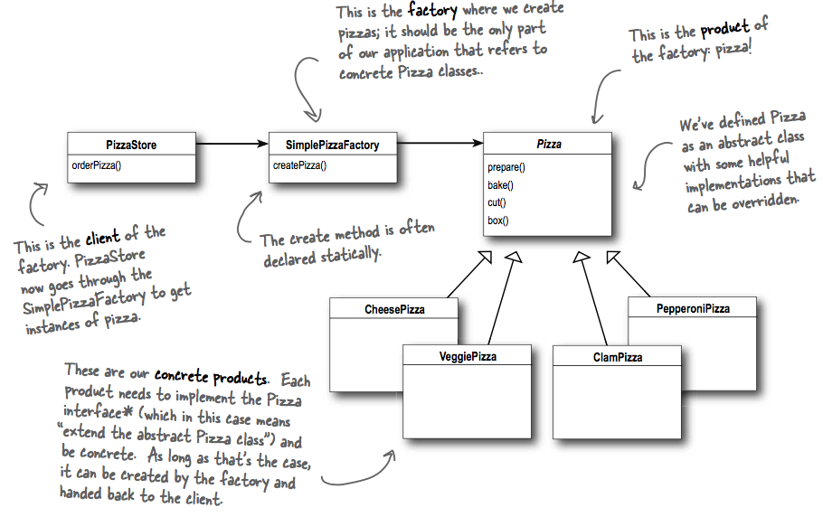

## What it's used for?
- It is not actually a design pattern, some people mistake this idiom for the Factory Pattern.
- Encapsulate creation logic to another class -> one place to make modifications when implementation changes.

## How to use?
- UML:


## Which principles it derives?
- Programming to an supertype, not an implementation:
  In the PizzaStore.orderPizza method:
  ```
  Pizza pizza = createPizza(type)
  pizza.prepare()
  pizza.bake()
  pizza.cut()
  pizza.box()
  ```
  it only cares about what the `pizza` object can do, not which concrete type it is.
  
  If you have additional types of Pizza, it doesn't affect the PizzaStore, because the PizzaStore is not tightly coupled with any concrete type of Pizza.
  
- Encapsuate what varies: encapsulate the code that creates objects.

- Dependency Inversion.

## Downsides
- Hard to extend if you want to have multiple kinds of SimplePizzaFactory. Abstract Factory could address this in a flexible way.
