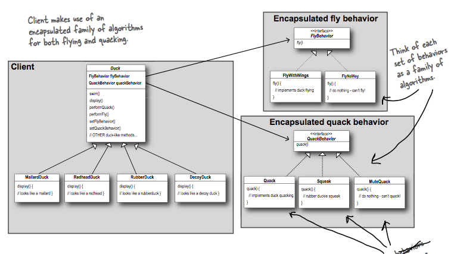

---

Use case:
- `Duck` base class (an abstract or normal class), there are many types of duck (subclasses) inherit from `Duck`.
- Some types of duck can fly, some types of duck can quack. There are also different types of fly behavior and quack behavior too.
- In this case, we shouldn't put fly and duck into `Duck` base class, since not that every types of duck need them.
- We need to separate fly and duck behavior out of `Duck` base class by having them in a separated set of classes that inherit from `FlyBehavior` and `QuackBehavior` supertype. Then in `Duck` base class we will have 2 instances of them, and 2 methods `performFly` and `performQuack` that use those 2 to perform fly and quack.
- Now the subclass of `Duck` only need to assign the specific type of behavior they want for the 2 instances.

---

**Principle - Encapsulate what varies**: Take the parts that vary and encapsulate them, so that later you can alter or extends the parts that vary without affecting those that don't.

---

**Principle - Programming to an supertype (interface, abstract class), not an implementation**: the declared type of the variables should be a supertype, usually an abstract class or interface, so that the objects assigned to those variables can be of any concrete implementation of the supertype, which means the class declaring them doesn’t have to know about the actual object types.

```java
// Programming to implementation:
Dog dog = new Dog()
dog.bark()

// Programming to supertype
Animal animal = new Dog()
animal.makeSound()  // Dog's makeSound implements Animal's makeSound
```

---

**Principle - Favor composition over inheritance**: HAS-A can be better than IS-A. (`Duck` has `FlyBehavior` and `QuackBehavior`).

---

One of the secrets to creating maintainable OO systems is thinking about how they might change in the future and these principles address those issues.

---

**Strategy pattern**: defines a family of algorithms (behaviors), encapsulates each one, and makes them interchangable. Strategy lets the algorithm independently from clients that use it.
