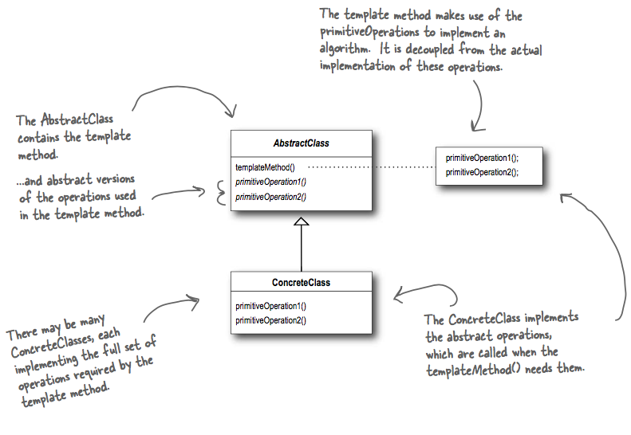

## What it's used for?
- defines the skeleton of an algorithm in a method (template method), deferring some steps to subclasses. Template Method lets subclasses redefine certain steps of an algorithm without changing the algorithm's structure.
- Template Method appears in sorting algorithms when we need to implements the compare method.

## How to use?
- UML:


- In the template method, beside abstract methods, we can also have **hook**:
  ```
  templateMethod()
    primitiveOp1();
    primitiveOp2();
    hook();
    
  hook()  # Do nothing by default, subclasses are free to override this but don't have to.
  ```

## Which principles it derives?
- Hollywood - don't call us, we'll call you - pattern: high-level components is the AbstractClass, it calls methods that is implemented in subclasses (low-level components) in the template method.

## Compare to Strategy and Factory
- Strategy: Encapsulate interchangeable behaviors and use delegation to decide which behavior to use (many algos). More flexible since client can change algo at runtime.
- Template Method: Subclasses decide how to implement steps in an algorithm (1 algo). Avoid code duplication.
- Factory: Subclasses decide which concrete classes to create.
