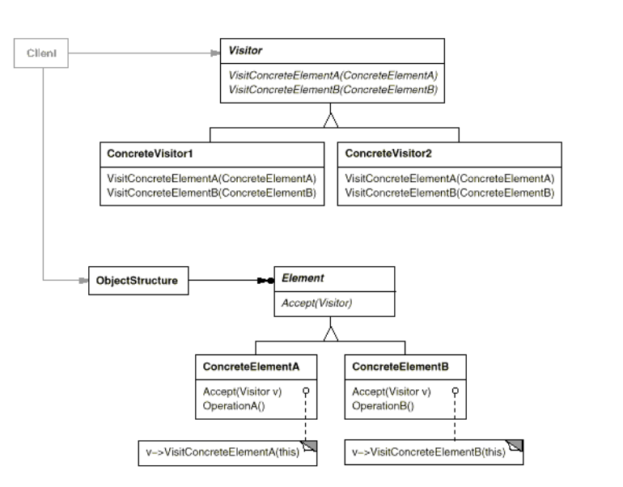
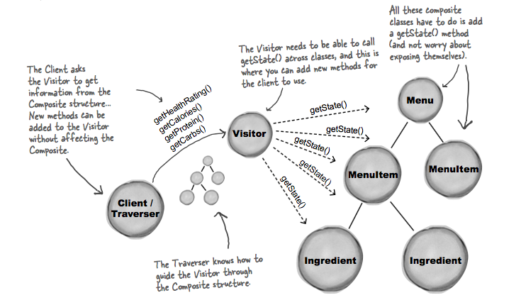

## What it's used for?
- Represent an operation to be performed on the elements of an object structure. Visitor lets you define a new operation without changing the classes of the elements on which it operates.
- Use this pattern when you want to add capabilities to a composite of objects and encapsulation is not important (the visitor object is separated from the composite).

## How to use?
- UML:

- Example:

